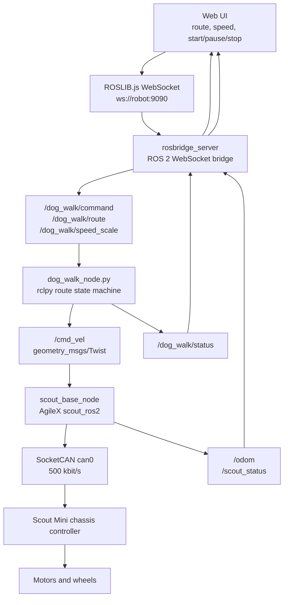

# Scout Dog Walk for ROS 2 Jazzy

This is the cleaned ROS 2 Jazzy copy of the hackathon Scout Mini dog-walk demo.

Original source was copied from:

```text
/home/guliwa/claude_dev/scout_dog_walk
```

This canonical working copy lives at:

```text
/home/guliwa/scout_dog
```

## Runtime Architecture



## Build

```bash
source /opt/ros/jazzy/setup.bash
mkdir -p ~/scout_dog_ws/src
ln -sfn /home/guliwa/scout_dog ~/scout_dog_ws/src/scout_dog_walk
cd ~/scout_dog_ws
colcon build --symlink-install
```

## Run

Bring up CAN:

```bash
/home/guliwa/scout_ws/scripts/setup_can0_500k.sh
```

Launch the full demo through the guarded script:

```bash
bash /home/guliwa/scout_dog/start.sh
```

The script publishes a zero `/cmd_vel` before cleanup, avoids duplicate dog-walk/rosbridge/web/scout-base processes, and binds rosbridge to the Tailscale IP when available.

## Sim First

The simulation path uses Gazebo Harmonic through `scout_gazebo_sim` and does not start the real CAN driver.
It sends dog-walk velocity commands to `/scout_mini/cmd_vel`.
The simulation launch allows `speed_scale` up to `3.0` for faster headless route checks; the real robot launch keeps the safer default max of `1.0`.

```bash
source /opt/ros/jazzy/setup.bash
source ~/scout_sim_ws/install/setup.bash
ros2 launch scout_dog_walk dog_walk_sim.launch.py web_port:=19181 rosbridge_port:=19090
```

If the real robot stack is already using rosbridge on `9090`, run the simulator on a separate WebSocket port:

```bash
ros2 launch scout_dog_walk dog_walk_sim.launch.py web_port:=19181 rosbridge_port:=19090
```

Open the UI from a browser on the same network:

```text
http://robot-ip:8080
```

The UI talks to rosbridge at:

```text
ws://robot-ip:9090
```

## Route Targets

- `短途如厕` / `home`: 3m straight out, 180 degree turn, 3m straight back.
- `小区散步` / `neighborhood`: 2.5m square loop.
- `公园放松` / `park`: 4.5m one-way S curve with a stronger visible bend and final heading recovered.

## Deployment Boundary

The real robot control stack must run on the Ubuntu computer connected to Scout Mini CAN:

- `scout_base_node`
- `rosbridge_server`
- `dog_walk_node.py`
- `web_server.py`

A public cloud server should only host a public demo/story page or a carefully protected proxy. Do not expose raw rosbridge or `/cmd_vel` control to the public internet.
